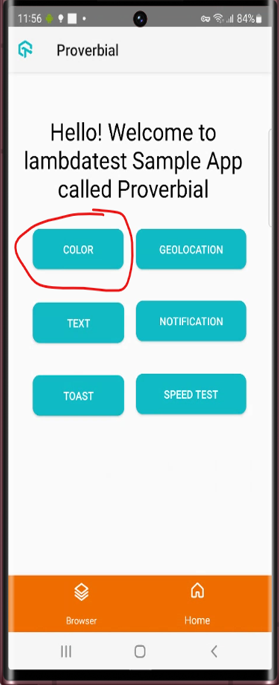

Task-1 :
Objective: Write an automated test to open an application and validate a string on the page using WebDriverIO. Follow industry standards to create a framework.

Steps to Complete the Task:
1. Framework Setup
•	Initialize Project:
o	Create a new directory for the project and initialize it with npm init.
o	Install WebDriverIO and related dependencies using  
npm install @wdio/browserstack-service --save-dev
npm install --save-dev @wdio/cli 
npm install webdriverio
@wdio/local-runner
 @wdio/mocha-framework
 @wdio/sync 

•	Configure WebDriverIO:
o	Run npx wdio config to generate the wdio.conf.js configuration file.
o	Configure the desired capabilities (e.g., browser, base URL) and reporters in the configuration file.
